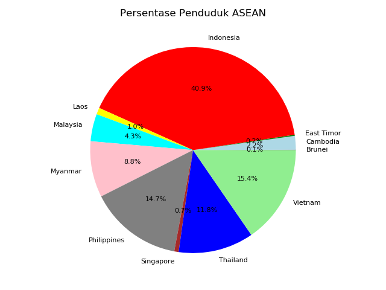
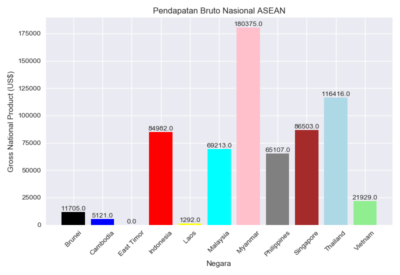
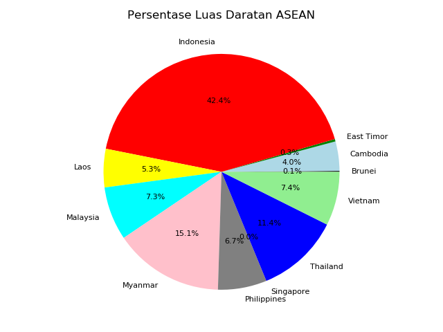

# Ujian Data Science - Analytics & Visualization - Soal No. 2

#

### **Soal 2 - Infografis ASEAN**
Menggunakan database *world* yang terdapat pada program mySQL, didapat: 
1. __Populasi ASEAN__
    

#

2. __Persentase Populasi ASEAN__
    

#

3. __Gross National Product ASEAN__
    

#

4. __Persentase Luas Daratan ASEAN__
    

 
#

### **_Enjoy!_**

#

#### Albertus Rianto Wibisono ✉ _albertusrian95@gmail.com_

[Instagram](https://www.instagram.com/rian__wibisono) | 
[LinkedIn](https://www.linkedin.com/in/albertusrian95/) |
[GitHub](https://www.github.com/RiantoWibisono)